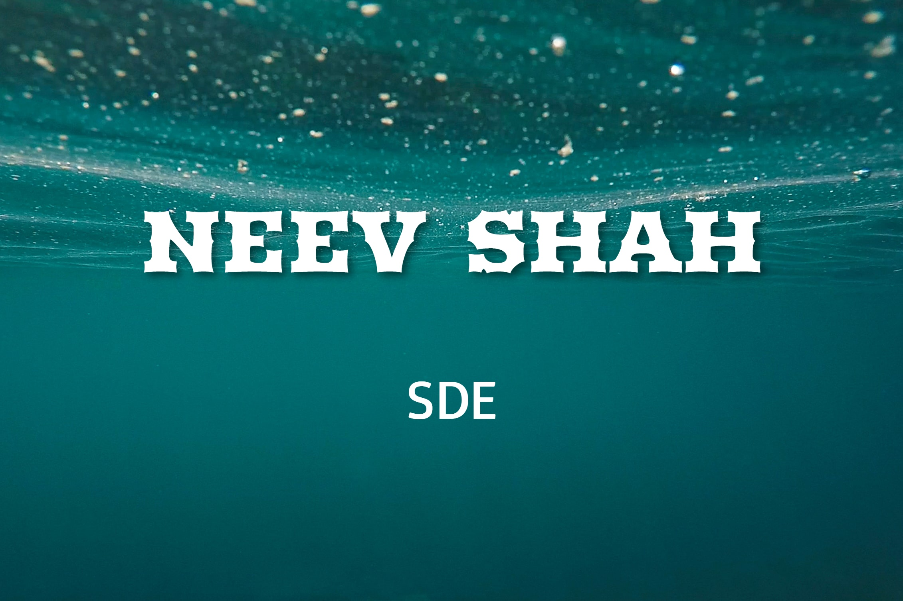

<!-- 
 -->
<!--   

 -->

  
  <!--
  
  
  -->
  
  
  
  
  
  

Hello World 👋
 
 
I'm Neev Shah, Computer Science & Engineering undergraduate student (2018-2022 batch) at Pandit Deendayal Petroleum University, Gandhinagar, India.
 
 
Areas of Expertise/Interest: Data Structures & Algorithms.

<h3>
  Projects 👨‍💻
</h3>
<ul>
  <li><a href="">ElectChain</a></li>
  <li><a href="https://github.com/neevshah1273/Nomadic">Nomadic</a></li>
  <li><a href="https://github.com/ParthPrajapati43/WebT_Project_Timeflux">TimeFlux</a></li>
  <li><a href="https://github.com/neevshah1273/CPU-Scheduling">CPU Scheduling Application</a></li>
  <li><a href="">WeatherApp</a></li>
  <li><a href="https://github.com/neevshah1273/AIRHOCKY">AirHockey-JAVA</a></li>
  <li><a href="https://github.com/neevshah1273/Car-Rental-Management-System">Car-rental Management System</a></li>
</ul>

<!--<h3>
  Latest Blogs 📝
</h3>
<ul>
  <li></li>
  <li><a href="https://nisargkapkar.hashnode.dev/image-and-video-background-removal-using-deep-learning">Image & Video Background Removal using Deep Learning</a></li>
  <li><a href="https://medium.com/analytics-vidhya/training-your-first-machine-learning-model-with-sklearn-e03d5de3bfba">Training your First Machine Learning Model with Python’s sklearn</a></li>
  <li><a href="https://nisargkapkar.hashnode.dev/nlp-basic-pattern-matching-using-pythons-spacy-library">NLP: Basic Pattern Matching using Python's spaCy library</a></li>
</ul>-->

<h3>
  Skills 💼
</h3>
<h4>Areas of Expertise/Interest</h4>

    

<h4>Programming Languages</h4>

  
  
  
  

<h4>Web Development</h4>

  
  
  
  
  
  
  
  
  

<h4>App Development</h4>

  

  
More Skills

  

  
  
  
  
  

<h3>
  GitHub Stats 📊
</h3>

  

  

